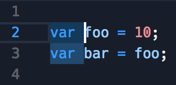
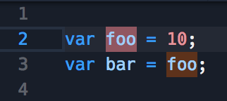

Sapphire is a vibrant blue theme for Visual Studio Code.

## Semantic colors

Colors in Sapphire have strong meaning.

- **Base color** is light blue
- **Keywords and operators** are blue
- **Classes, functions and member variables** are teal
- **Function calls** are yellow
- **Types** are green
- **Strings** are red
- **Numbers** are orange

Currently JavaScript and TypeScript are supported with the above. Other languages will still probably be colored but may not be colored completely and the color meanings may be off until they're explicitly supported. HTML, CSS and Markdown are also supported (but they don't need the semantics above),

If you see any inconsistencies you can report it on the [GitHub repo](https://github.com/Tyriar/vscode-theme-sapphire).

## Selection

Sapphire attempts to make selections more clear by giving them distinct colors which stack upon each other nicely.

**Word highlight** is used when the cursor is places over a word/symbol that the language extension recognizes, all other occurrences of the symbol are also highlighted. It's colored using a transparent white.

**Selection highlight** is blue. Other occurrences of the selection text are also highlighted with a slightly brighter blue.

**Find highlight** is used for all matches of find in file (<kbd>ctrl</kbd>/<kbd>cmd</kbd>+<kbd>f</kbd>) and find in files (<kbd>ctrl</kbd>/<kbd>cmd</kbd>+<kbd>shift</kbd>+<kbd>f</kbd>). It's colored in red with the active find selection bring brighter than the others and also having a background highlight.

